

 

 

 

 

 

 

 

[01] AI_DEEPFAKE // <a href="https://github.com/namann5/Ai_deepfake">github.com/namann5/Ai_deepfake</a> 
[02] HELPDESK.AI // <a href="https://github.com/namann5/HELPDESK.AI">github.com/namann5/HELPDESK.AI</a> 
[03] SECUSCAN // <a href="https://github.com/namann5/SecuScan">github.com/namann5/SecuScan</a> 
[04] MERGESHIP // <a href="https://github.com/namann5/MergeShip">github.com/namann5/MergeShip</a> 
[05] STORY-SPARK-AI // <a href="https://github.com/namann5/story-spark-ai">github.com/namann5/story-spark-ai</a> 
[06] ANIMEVERSE // <a href="https://github.com/namann5/Anime-muesuem">github.com/namann5/Anime-muesuem</a> · <a href="https://anime-muesuem.vercel.app">live</a>

 

 

 

 

 

 

 

 

 

 

  

  

 

swinging through code since 2024 — always learning, always building. never giving up.

