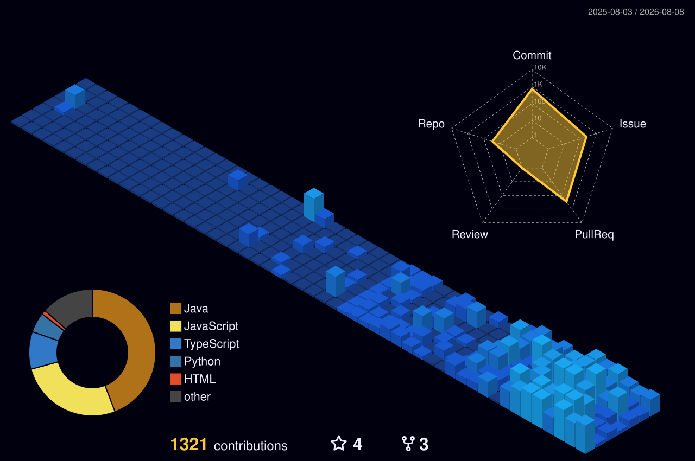



 

 

 

 

 

 

 

 

<h3 style="color:#E63946;font-family:'Cascadia Code',monospace;letter-spacing:6px">// GITHUB ACTIVITY // CONTRIBUTION_STREAM</h3>

> const uptime = "always building";

 

  

  

  

  

 

 

 

[01] DeepScan // <a href="https://github.com/namann5/Ai_deepfake">github.com/namann5/Ai_deepfake</a> 
[02] AutoPilot // <a href="https://github.com/namann5/autonomous-driving-system">github.com/namann5/autonomous-driving-system</a> 
[03] AnimeVerse // <a href="https://github.com/namann5/Anime-muesuem">repo</a> · <a href="https://anime-muesuem.vercel.app">live</a> 
[04] AI Support // <a href="https://github.com/namann5/Ai_Customer_Service">github.com/namann5/Ai_Customer_Service</a>

 

 

 

 

 

 

  

  

 

swinging through code since 2024 — always learning, always building. never giving up.

