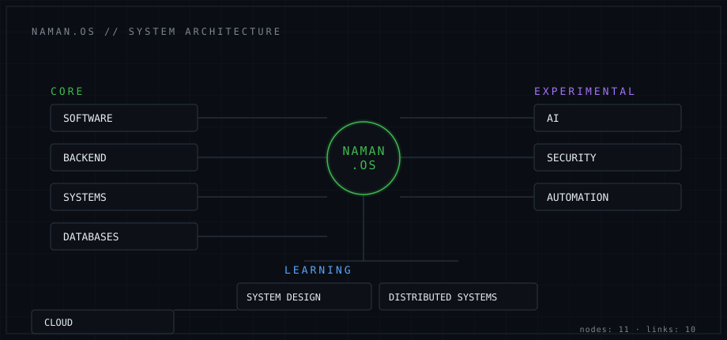
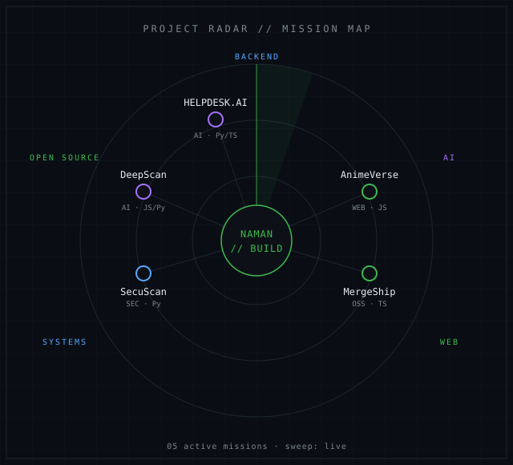
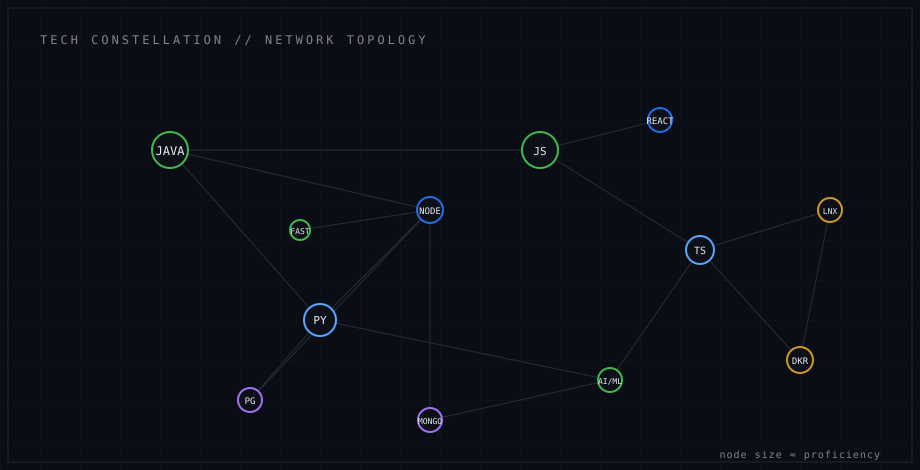
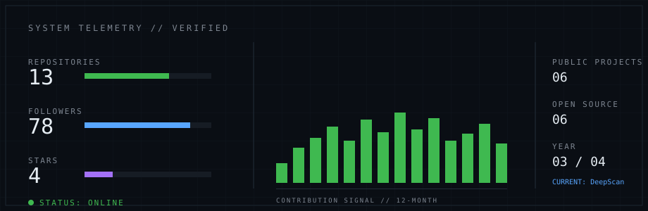

> initializing profile...
> loading identity · systems · projects · telemetry ......... **OK**
> SYSTEM READY.



> mostly building things I do not fully understand yet. on purpose.

---

## ◢ 01 / IDENTITY

```text
> query: whois naman

Naman is currently somewhere between
student and engineer — interested in what
happens after the button gets clicked.
```

| | |
|---|---|
| NAME | Naman Singh |
| CLASS | B.Tech / Computer Science |
| YEAR | 03 |
| STATUS | Student → Engineer |
| BASE | Agra, India |
| FOCUS | Software / Systems / AI |

---



---

## ◢ 04 / PROJECTS — MISSION CONTROL

| ID | PROJECT | CATEGORY | STATUS | LINK |
|----|---------|----------|--------|------|
| 001 | DeepScan | AI / Vision | ● DEPLOYED | [src](https://github.com/namann5/Ai_deepfake) · [live](https://ai-deepfake-rouge.vercel.app) |
| 002 | HELPDESK.AI | AI / Full-stack | ● DEPLOYED | [src](https://github.com/namann5/HELPDESK.AI) · [live](https://helpdeskai1918.vercel.app) |
| 003 | SecuScan | Security / Tooling | ● DEPLOYED | [src](https://github.com/namann5/SecuScan) · [live](https://secuscan.in) |
| 004 | MergeShip | Dev Tooling / OSS | ◐ BUILDING | [src](https://github.com/namann5/MergeShip) · [live](https://mergeship.vercel.app) |
| 005 | AnimeVerse | Frontend / Web | ● LIVE | [src](https://github.com/namann5/Anime-muesuem) · [live](https://anime-muesuem.vercel.app) |

---



---

## ◢ 03 / STACK

`Java` `Python` `JavaScript` `TypeScript` · `Node.js` `Express` `FastAPI` `React` · `PostgreSQL` `MongoDB` `Docker` `Linux` · `Computer Vision` `LLM tooling`

---



---

## ◢ ENGINEERING NOTES

```text
01  Read the error before blaming the framework.
02  Simple code is harder than clever code.
03  If the architecture is not yours to explain, you do not own it.
04  Ship first. Optimize when reality complains.
```

## ◢ KNOWN ISSUES

```text
[001] starts side projects at inconvenient times
[002] occasionally optimizes things that did not need optimization
[003] README is probably overengineered
[004] reads documentation only after the bug wins
```

<details>
  <summary>⚡ ./naman --help</summary>

```bash
Usage:
  build       build something
  learn       learn something
  break       probably inevitable
  fix         eventually
  sleep       TODO
```

</details>

---



---

## ◢ 06 / OPEN SOURCE

maintaining: `DeepScan` · `HELPDESK.AI` · `SecuScan` · `MergeShip` · `AnimeVerse` · `Autopilot`
external contributions: `[ ADD YOUR PRs / ISSUES HERE ]`

## ◢ 08 / TRANSMISSION

| CHANNEL | ADDRESS |
|---------|---------|
| github | [namann5](https://github.com/namann5) |
| linkedin | [naman-singh-513260299](https://linkedin.com/in/naman-singh-513260299) |
| mail | [naman.2002.as@gmail.com](mailto:naman.2002.as@gmail.com) |
| web | [namann5.github.io](https://namann5.github.io) |
| leetcode | [namann5](https://leetcode.com/namann5) |
| dev.to | [naman_singh](https://dev.to/naman_singh_e807dfdf14b5c) |

---


