


 

 

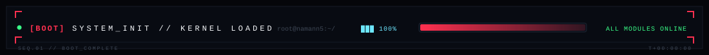

 

 


 

 


 

 


 

 


 

 


 

 


 

[01] DEEPSCAN // <a href="https://github.com/namann5/Ai_deepfake">github.com/namann5/Ai_deepfake</a> · <a href="https://ai-deepfake-rouge.vercel.app">live</a> 
[02] HELPDESK.AI // <a href="https://github.com/namann5/HELPDESK.AI">github.com/namann5/HELPDESK.AI</a> · <a href="https://helpdeskai1918.vercel.app">live</a> 
[03] SECUSCAN // <a href="https://github.com/namann5/SecuScan">github.com/namann5/SecuScan</a> · <a href="https://secuscan.in">live</a> 
[04] MERGESHIP // <a href="https://github.com/namann5/MergeShip">github.com/namann5/MergeShip</a> · <a href="https://mergeship.vercel.app">live</a> 
[05] ANIMEVERSE // <a href="https://github.com/namann5/Anime-muesuem">github.com/namann5/Anime-muesuem</a> · <a href="https://anime-muesuem.vercel.app">live</a> 
[06] AUTOPILOT // <a href="https://github.com/namann5/autonomous-driving-system-clean">github.com/namann5/autonomous-driving-system-clean</a>

 


 

 


 

 


 

 

 

 

  

 

N5 // CONTINUUM — still building. always learning, always shipping.

