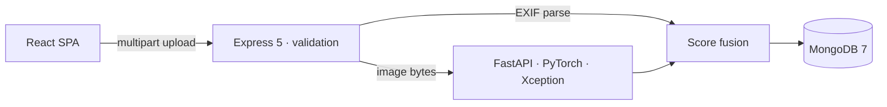
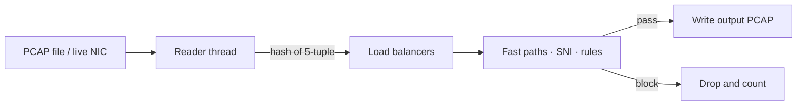
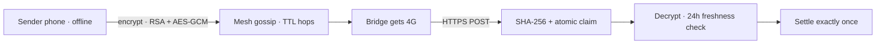

<h1 align="center">Naman Singh</h1>

<p align="center">
  <b>Backend &amp; security engineering</b> · Agra, Uttar Pradesh, India
</p>

I'm a backend engineer with a habit of reading source looking for the auth bug.
Most of the work I'm proud of is unglamorous — tokens redacted out of logs,
injection paths closed, credentials pulled from source — because software should
survive a bad day, not just a demo. Open to internships, remote roles and
freelance work.

Now: prepping for placements — DSA, system design, and security write-ups.

<p align="center">
  <picture>
    <source media="(prefers-color-scheme: dark)" srcset="assets/stats-dark.svg">
    
  </picture>
  <picture>
    <source media="(prefers-color-scheme: dark)" srcset="assets/top-langs-dark.svg">
    
  </picture>
</p>

## What I build

- **[DeepScan](https://github.com/namann5/Ai_deepfake)** — tells you whether an
  image is AI-generated: Xception inference, EXIF camera/GPS forensics, weighted
  score fusion across a four-service Docker stack. I owned backend and testing.
  [Live](https://ai-deepfake-rouge.vercel.app) · `Node.js` `FastAPI` `PyTorch` `React` `MongoDB`
- **[AnimeVerse](https://github.com/namann5/Anime-muesuem)** — a museum you walk
  through instead of scroll: era timelines, a cinema, a 3D character gallery on
  React + Firebase. 85 commits. [Live](https://animeverse-mvp.vercel.app) · `React` `Firebase`
- **[Packet_analyzer](https://github.com/namann5/Packet_analyzer)** — a DPI
  engine in C++. Parses PCAP byte-by-byte and pulls the hostname out of TLS
  Client Hellos (HTTPS leaks SNI in plaintext before encryption starts), then
  blocks flows by IP/app/domain rule. Packets route reader → load balancer →
  fast path by consistent hash of the 5-tuple, so every packet of one
  connection always lands on the same thread. Live capture via libpcap,
  JSON rules + CLI, CI on Linux/macOS/Windows.
- **[UpiWithoutInternet](https://github.com/namann5/UpiWithoutInternet)** —
  offline UPI over a Bluetooth-style mesh: the payment hops phone-to-phone
  encrypted until one device gets signal, then the Spring Boot backend claims
  the ciphertext hash atomically — three bridges delivering the same packet at
  once still settle exactly once — decrypts and pays out. Hybrid RSA-OAEP +
  AES-256-GCM, freshness window, 47 tests. `Java` `Spring Boot`
- **[namancraft](https://github.com/namann5/namancraft)** — a Minecraft-style
  3D portfolio in the browser: voxel world with portal dimensions for projects,
  skills and socials, custom voxel mesher, Blender pipeline that generates the
  world, day/night cycle, touch controls, live GitHub and LeetCode numbers.
  React Three Fiber. [Live](https://namann5.github.io/namancraft/)

How they work, in one picture:

**DeepScan**


```mermaid
flowchart LR
    B[React SPA] -->|multipart upload| E[Express 5 · validation]
    E -->|image bytes| X[FastAPI · PyTorch · Xception]
    E -->|EXIF parse| F[Score fusion]
    X --> F
    F --> D[(MongoDB 7)]
```

**Packet_analyzer**


```mermaid
flowchart LR
    C[PCAP file / live NIC] --> R[Reader thread]
    R -->|hash of 5-tuple| L[Load balancers]
    L --> F[Fast paths · SNI · rules]
    F -->|pass| W[Write output PCAP]
    F -->|block| D[Drop and count]
```

**UpiWithoutInternet**


```mermaid
flowchart LR
    A[Sender phone · offline] -->|encrypt · RSA + AES-GCM| G[Mesh gossip · TTL hops]
    G --> B[Bridge gets 4G]
    B -->|HTTPS POST| H[SHA-256 + atomic claim]
    H --> X[Decrypt · 24h freshness check]
    X --> Z[Settle exactly once]
```

## What I patch

Auth tokens used to go straight into the console — and from there into Metro
logs, device logs and Sentry. From a [merged fix](https://github.com/SB2318/UltimateHealth/pull/2320):

```diff
- console.log('[Login] res.data.token:', res.data?.token);
+ console.log('[Login] res.data.token:', res.data?.token ? 'present' : 'absent');
```

The log still tells you the token arrived; it just doesn't print the value.

Other things that made it through review, all merged:

- [Auth token never persisted in plaintext storage](https://github.com/SB2318/UltimateHealth/pull/2306)
- [Bypassable regex sanitizer replaced with an entity-aware tag sanitizer](https://github.com/SB2318/UltimateHealth/pull/2354)
- [Hardcoded Vultr API credential pulled out of source](https://github.com/SB2318/UltimateHealth/pull/2356)

## Open source

179 merged pull requests in repositories I don't own · 0 open —
[browse them yourself](https://github.com/search?q=author%3Anamann5+is%3Apr+is%3Amerged&type=pullrequests).

## Contact

<p align="center">
  <a href="https://www.linkedin.com/in/naman-singh-513260299"></a>
  <a href="mailto:naman.2002.as@gmail.com"></a>
  <a href="https://noctratech.me"></a>
  <a href="https://leetcode.com/namann5"></a>
</p>
