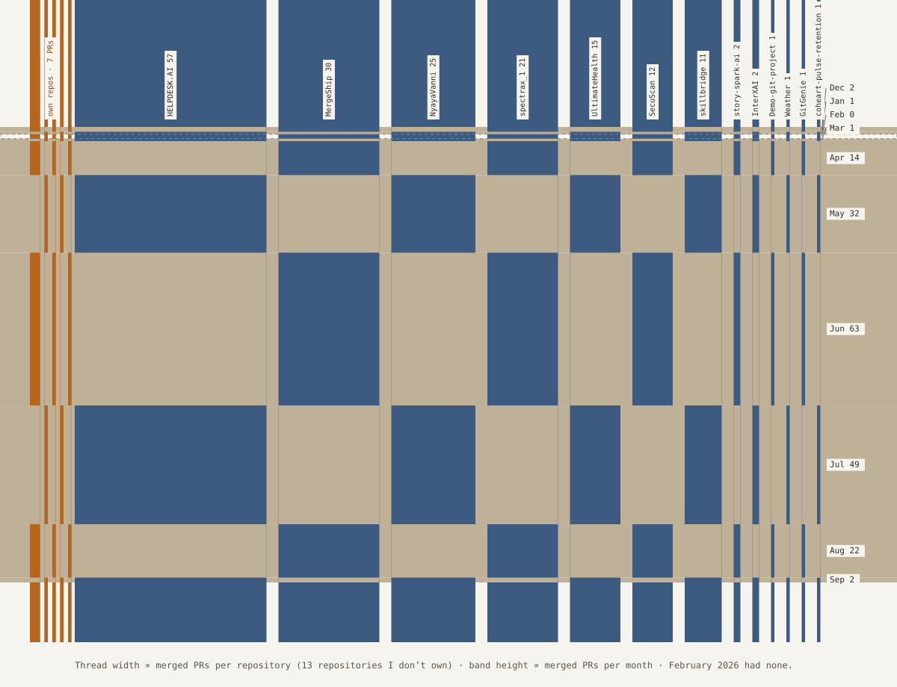

<h1 align="center">Naman Singh</h1>

<p align="center">
  <b>Backend &amp; security engineering</b> · Agra, Uttar Pradesh, India
</p>

I'm a backend engineer with a habit of reading source looking for the auth bug.
Most of the work I'm proud of is unglamorous — tokens redacted out of logs,
injection paths closed, credentials pulled from source — because software should
survive a bad day, not just a demo. Open to internships, remote roles and
freelance work.

<p align="center">
  <picture>
    <source media="(prefers-color-scheme: dark)" srcset="assets/stats-dark.svg">
    
  </picture>
  <picture>
    <source media="(prefers-color-scheme: dark)" srcset="assets/top-langs-dark.svg">
    
  </picture>
</p>

## What I build

- **[DeepScan](https://github.com/namann5/Ai_deepfake)** — tells you whether an
  image is AI-generated: Xception inference, EXIF camera/GPS forensics, weighted
  score fusion across a four-service Docker stack. I owned backend and testing.
  [Live](https://ai-deepfake-rouge.vercel.app) · `Node.js` `FastAPI` `PyTorch` `React` `MongoDB`
- **[AnimeVerse](https://github.com/namann5/Anime-muesuem)** — a museum you walk
  through instead of scroll: era timelines, a cinema, a 3D character gallery on
  React + Firebase. 85 commits. [Live](https://animeverse-mvp.vercel.app) · `React` `Firebase`
- **[Packet_analyzer](https://github.com/namann5/Packet_analyzer)** —
  multi-threaded deep packet inspection engine written in C++.
- **[namancraft](https://github.com/namann5/namancraft)** — Minecraft-style
  build mode that runs in the browser.

## What I patch

Representative diffs — not verbatim, but the shape of most of my merged PRs:

```diff
- logger.info("POST /api/otp/verify token=" + req.body.token)
+ logger.info("POST /api/otp/verify", { userId: user.id, ok: true })
```

```diff
- res.send(`<p>Welcome ${req.query.name}</p>`)
+ res.send(`<p>${escapeHtml(req.query.name)}</p>`)
```

Beyond that: BOLA and cross-tenant holes closed, CSV formula injection fixed,
open-redirect validation added, plaintext token persistence removed, hardcoded
credentials pulled out of source.

## Activity

1,786 contributions over 196 active days · best day 39 · 15 repositories of my own.

<picture>
  <source media="(prefers-color-scheme: dark)" srcset="assets/weave-dark.svg">
  
</picture>

## Open source

179 merged pull requests in repositories I don't own · 0 open —
[browse them yourself](https://github.com/search?q=author%3Anamann5+is%3Apr+is%3Amerged&type=pullrequests).

## Contact

<p align="center">
  <a href="https://www.linkedin.com/in/naman-singh-513260299"></a>
  <a href="mailto:naman.2002.as@gmail.com"></a>
  <a href="https://noctratech.me"></a>
  <a href="https://leetcode.com/namann5"></a>
</p>
